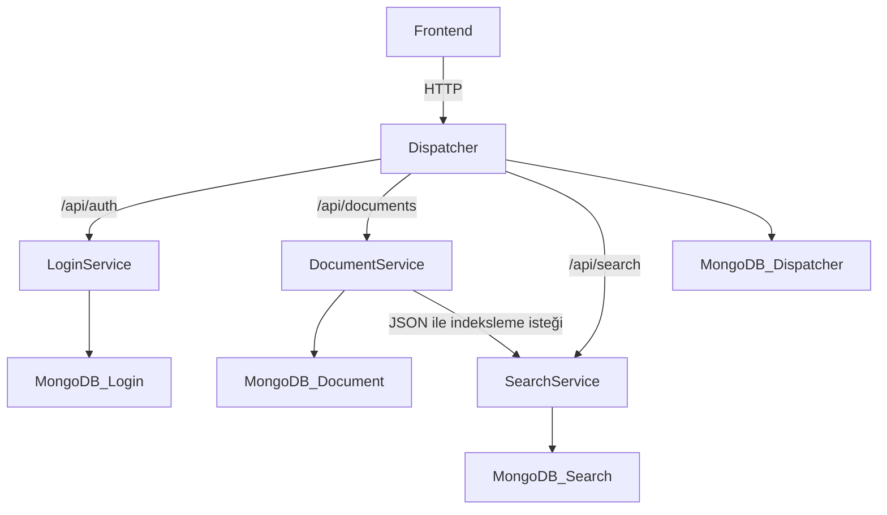
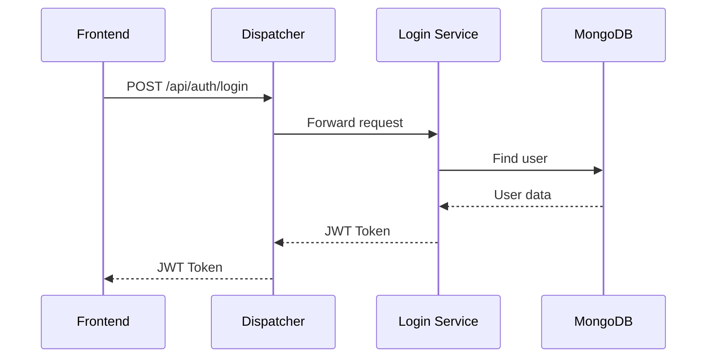
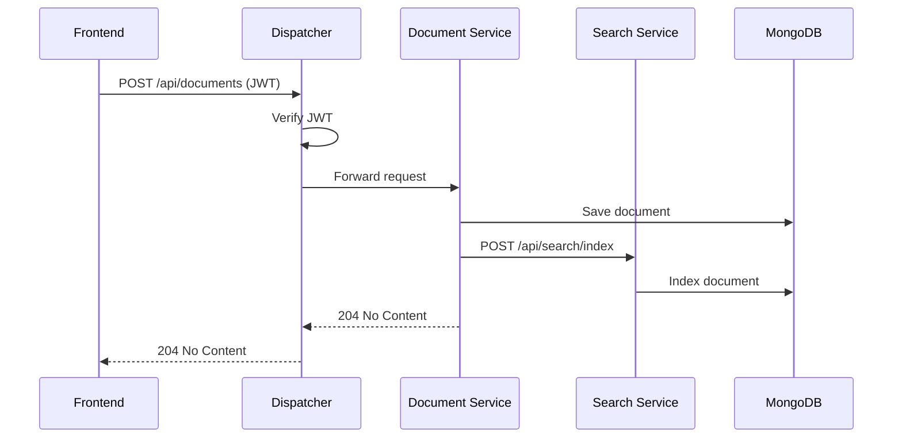
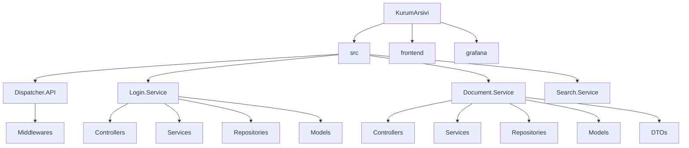
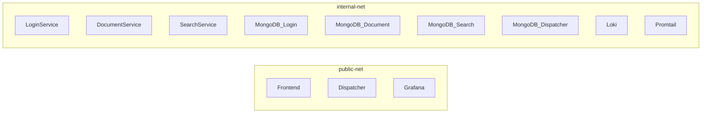

# Kurum Arşivi
## 1. Proje Bilgileri
* **Ders:** Yazılım Geliştirme Laboratuvarı-II / Proje-1
* **Proje Adı:** Kurum Arşivi
* **Teslim Tarihi:** 05.04.2026
* **Ekip Üyeleri:**
  * Şevval Ceren Yıldız
  * Sudenaz Güldal
---
## 2. Giriş

### Problemin Tanımı
Kurumsal ortamlarda belgelerin yönetimi, aranması ve güvenli erişimi büyük önem taşımaktadır. Geleneksel dosya sistemleri ve tek parçalı uygulamalar, ölçeklenebilirlik ve bakım açısından ciddi sorunlar yaratmaktadır.

### Amaç
Bu proje, kurumsal belgelerin dijital ortamda güvenli bir şekilde saklanmasını, yönetilmesini ve aranmasını sağlayan mikroservis tabanlı bir arşiv sistemi geliştirmeyi amaçlamaktadır.

### Kapsam
Sistem aşağıdaki bileşenlerden oluşmaktadır:
- **Dispatcher (API Gateway):** Tüm dış isteklerin tek giriş noktası
- **Login Service:** Kullanıcı kimlik doğrulama ve yetkilendirme
- **Document Service:** Belge ekleme, silme, listeleme işlemleri
- **Search Service:** Belge arama ve indeksleme
- **Frontend:** Kullanıcı arayüzü
---
## 3. Sistem Tasarımı

### Richardson Olgunluk Modeli (RMM)
Bu projede REST API tasarımında **Seviye 2** uygulanmıştır:

- **Seviye 0:** Tek endpoint, tek metot
- **Seviye 1:** Kaynaklar URI ile tanımlanır (`/api/documents`, `/api/auth`)
- **Seviye 2 (Uygulanan):** HTTP metodları doğru kullanılır:
  - `GET` → Listeleme/okuma
  - `POST` → Oluşturma
  - `PUT` → Güncelleme
  - `DELETE` → Silme
  - Uygun HTTP durum kodları: `200`, `201`, `204`, `401`, `403`, `404`, `409`
 
 #### Uygulanan REST örnekleri

- `POST /api/auth/login` → kullanıcı girişi
- `POST /api/auth/register` → yeni kullanıcı oluşturma
- `GET /api/auth/users` → kullanıcıları listeleme
- `DELETE /api/auth/users/{username}` → kullanıcı silme
- `PUT /api/auth/users/{username}/role` → kullanıcı rolü güncelleme
- `GET /api/documents` → belgeleri listeleme
- `GET /api/documents/{id}` → tek belge getirme
- `POST /api/documents` → belge oluşturma
- `PUT /api/documents/{id}` → belge güncelleme
- `DELETE /api/documents/{id}` → belge silme
- `GET /api/search?q=...` → belge arama
- `POST /api/search/index` → indeks oluşturma/güncelleme
- `DELETE /api/search/index/{documentId}` → arama indeksinden belge silme

Bu yapı sayesinde proje, `.../deleteUser?id=1` gibi RPC benzeri tasarım yerine kaynak odaklı REST yaklaşımını kullanmaktadır.

### Mikroservis Mimarisi

### Sequence Diyagramı - Login

### Sequence Diyagramı - Belge Ekleme

---
## 4. Proje Yapısı ve Modüller

### Klasör Yapısı

### Servisler

| Servis | Port | Görev |
|--------|------|-------|
| Dispatcher | 5000 | API Gateway, JWT doğrulama, yönlendirme |
| Login Service | 8080 | Kullanıcı kayıt, giriş, JWT üretme |
| Document Service | 8080 | Belge CRUD işlemleri |
| Search Service | 8080 | Belge arama ve indeksleme |
| Frontend | 3000 | Kullanıcı arayüzü |
| Grafana | 3001 | Log görselleştirme |

### Docker Ağ Yapısı

---

## Network Isolation

Bu projede mikroservisler arası güvenlik ve erişim kontrolü için **network isolation** yaklaşımı uygulanmıştır. Amaç, sistemde dış dünyaya yalnızca **Dispatcher (API Gateway)** servisinin açık olması; Login, Document ve Search mikroservislerinin ise yalnızca Docker iç ağı üzerinden erişilebilir tutulmasıdır.

### Uygulanan yapı

- **Dispatcher**
  - Hem `public-net` hem `internal-net` ağına bağlıdır.
  - Host makineye `5000:8080` port eşlemesi ile açılmıştır.
  - Sistemin dış dünyaya açık olan ana backend giriş noktasıdır.

- **Login Service**
  - Yalnızca `internal-net` ağına bağlıdır.
  - Host makineye publish edilmiş bir portu yoktur.

- **Document Service**
  - Yalnızca `internal-net` ağına bağlıdır.
  - Host makineye publish edilmiş bir portu yoktur.

- **Search Service**
  - Yalnızca `internal-net` ağına bağlıdır.
  - Host makineye publish edilmiş bir portu yoktur.

- **MongoDB servisleri**
  - Her servis için ayrı MongoDB container’ı kullanılmıştır.
  - Bu veritabanı servisleri de yalnızca `internal-net` ağı üzerinde çalışmaktadır.

Bu tasarım sayesinde dış istemciler mikroservislere doğrudan erişemez. Tüm dış istekler önce Dispatcher’a gelir, Dispatcher da uygun mikroservise yönlendirme yapar.

### Docker Compose düzeyinde izolasyon

Network isolation, Docker Compose yapılandırmasında aşağıdaki prensiplerle sağlanmıştır:

1. **Dispatcher hem public hem internal ağa bağlıdır.**
2. **Mikroservisler yalnızca internal ağda tanımlanmıştır.**
3. **Login, Document ve Search servisleri için host port publish edilmemiştir.**
4. **MongoDB servisleri de dış dünyaya açılmamıştır.**

Bu nedenle:
- dış istemci yalnızca Dispatcher’a erişebilir,
- mikroservisler yalnızca Docker iç ağı üzerinden haberleşir,
- veri tabanı katmanı dış erişime kapalı tutulur.

### Kanıtlayıcı ekran görüntüleri

#### 1. Servislerin port görünümü (`docker compose ps`)
Aşağıdaki çıktıda yalnızca Dispatcher servisinin host port eşlemesine sahip olduğu, diğer mikroservislerin ise yalnızca container iç portları ile çalıştığı görülmektedir.

**Şekil Açıklaması:**  
`docker compose ps` çıktısında Dispatcher için `5000->8080` port eşlemesi görünürken, `login-service`, `document-service` ve `search-service` için host port publish edilmediği görülmektedir. Bu durum mikroservislerin doğrudan dış erişime kapalı tutulduğunu göstermektedir.

---

#### 2. Dispatcher servis yapılandırması
Aşağıdaki yapılandırmada Dispatcher servisinin hem `public-net` hem `internal-net` üzerinde çalıştığı ve `5000:8080` port eşlemesi ile dış erişime açıldığı görülmektedir.

**Şekil Açıklaması:**  
Dispatcher servisi hem dış ağ hem iç ağ arasında köprü görevi görmekte ve sistemin tek backend giriş noktası olarak çalışmaktadır.

---

#### 3. Login Service yapılandırması
Aşağıdaki yapılandırmada Login Service’in yalnızca `internal-net` üzerinde tanımlandığı ve host’a publish edilmiş bir portunun bulunmadığı görülmektedir.

**Şekil Açıklaması:**  
Login Service yalnızca iç ağda çalışmakta, dış dünyaya doğrudan açılmamaktadır.

---

#### 4. Document Service yapılandırması
Aşağıdaki yapılandırmada Document Service’in yalnızca `internal-net` üzerinde çalıştığı görülmektedir.

**Şekil Açıklaması:**  
Document Service host makineye publish edilmemiştir; bu nedenle yalnızca Docker iç ağı üzerinden erişilebilir.

---

#### 5. Search Service yapılandırması
Aşağıdaki yapılandırmada Search Service’in yalnızca `internal-net` ağı üzerinde bulunduğu görülmektedir.

**Şekil Açıklaması:**  
Search Service dış istemcilere doğrudan açık değildir ve sadece iç ağ üzerinden erişilir.

### Sonuç

Bu projede network isolation, Docker Compose ağ yapısı ve port publish tercihleriyle sağlanmıştır. Dispatcher dış dünyaya açık tek backend bileşeni olarak konumlandırılmış; Login, Document ve Search servisleri ile bunlara ait MongoDB bileşenleri yalnızca iç ağ üzerinde tutulmuştur. Böylece mikroservis mimarisinde güvenlik, erişim kontrolü ve merkezi trafik yönetimi hedeflerine uygun bir yapı elde edilmiştir.
