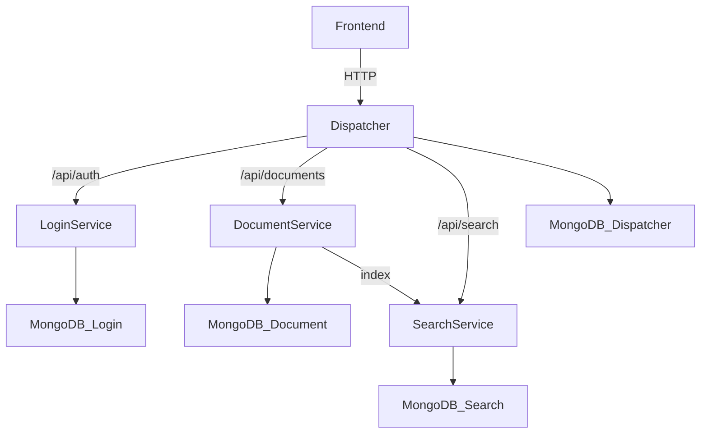
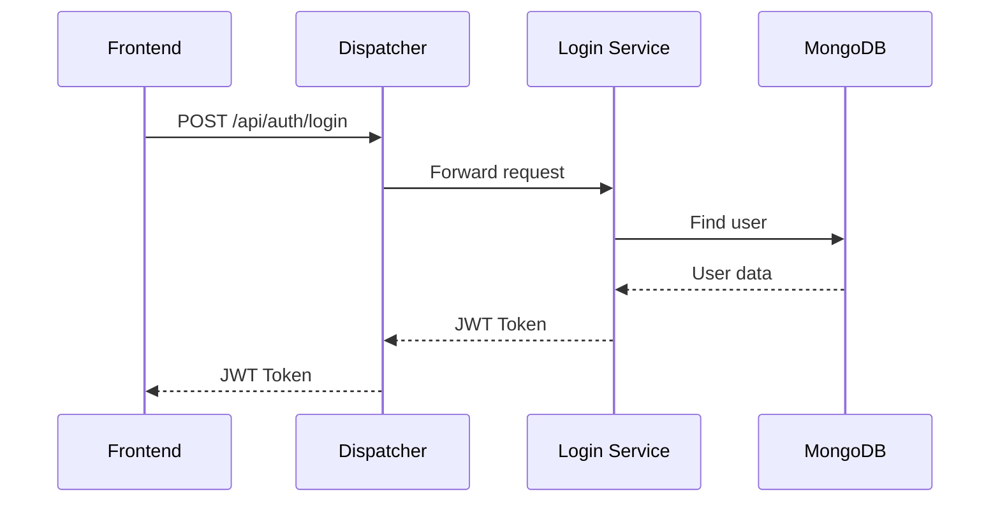
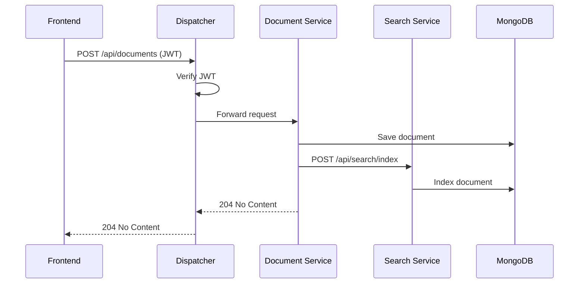
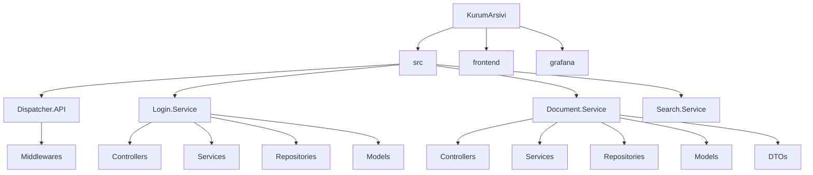
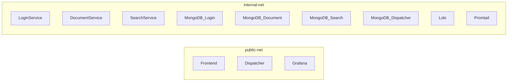

# Kurum Arşivi
## 1. Proje Bilgileri
* **Ders:** Yazılım Geliştirme Laboratuvarı-II / Proje-1
* **Proje Adı:** Kurum Arşivi
* **Teslim Tarihi:** 05.04.2026
* **Ekip Üyeleri:**
  * Şevval Ceren Yıldız
  * Sudenaz Güldal
---
## 2. Giriş

### Problemin Tanımı
Kurumsal ortamlarda belgelerin yönetimi, aranması ve güvenli erişimi büyük önem taşımaktadır. Geleneksel dosya sistemleri ve tek parçalı uygulamalar, ölçeklenebilirlik ve bakım açısından ciddi sorunlar yaratmaktadır.

### Amaç
Bu proje, kurumsal belgelerin dijital ortamda güvenli bir şekilde saklanmasını, yönetilmesini ve aranmasını sağlayan mikroservis tabanlı bir arşiv sistemi geliştirmeyi amaçlamaktadır.

### Kapsam
Sistem aşağıdaki bileşenlerden oluşmaktadır:
- **Dispatcher (API Gateway):** Tüm dış isteklerin tek giriş noktası
- **Login Service:** Kullanıcı kimlik doğrulama ve yetkilendirme
- **Document Service:** Belge ekleme, silme, listeleme işlemleri
- **Search Service:** Belge arama ve indeksleme
- **Frontend:** Kullanıcı arayüzü
---
## 3. Sistem Tasarımı

### Richardson Olgunluk Modeli (RMM)
Bu projede REST API tasarımında **Seviye 2** uygulanmıştır:

- **Seviye 0:** Tek endpoint, tek metot
- **Seviye 1:** Kaynaklar URI ile tanımlanır (`/api/documents`, `/api/auth`)
- **Seviye 2 (Uygulanan):** HTTP metodları doğru kullanılır:
  - `GET` → Listeleme/okuma
  - `POST` → Oluşturma
  - `PUT` → Güncelleme
  - `DELETE` → Silme
  - Uygun HTTP durum kodları: `200`, `201`, `204`, `401`, `403`, `404`, `409`

### Mikroservis Mimarisi

### Sequence Diyagramı - Login

### Sequence Diyagramı - Belge Ekleme

---
## 4. Proje Yapısı ve Modüller

### Klasör Yapısı

### Servisler

| Servis | Port | Görev |
|--------|------|-------|
| Dispatcher | 5000 | API Gateway, JWT doğrulama, yönlendirme |
| Login Service | 8080 | Kullanıcı kayıt, giriş, JWT üretme |
| Document Service | 8080 | Belge CRUD işlemleri |
| Search Service | 8080 | Belge arama ve indeksleme |
| Frontend | 3000 | Kullanıcı arayüzü |
| Grafana | 3001 | Log görselleştirme |

### Docker Ağ Yapısı

---
