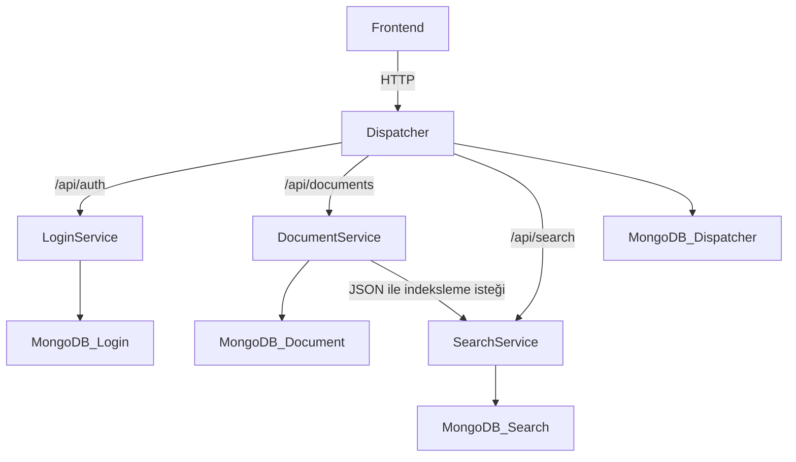
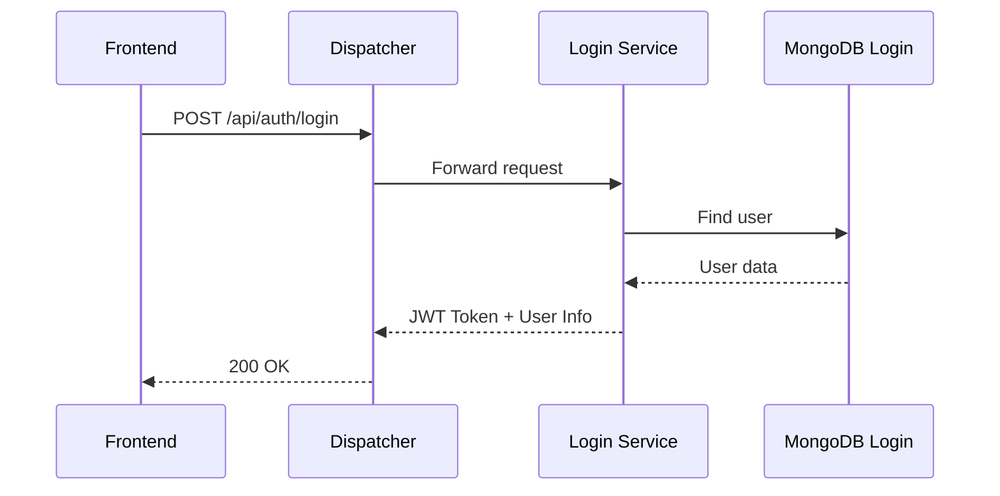
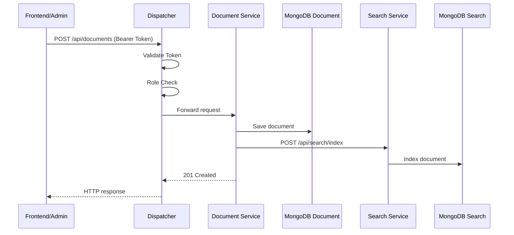
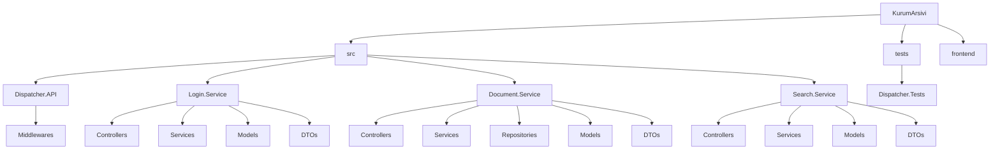
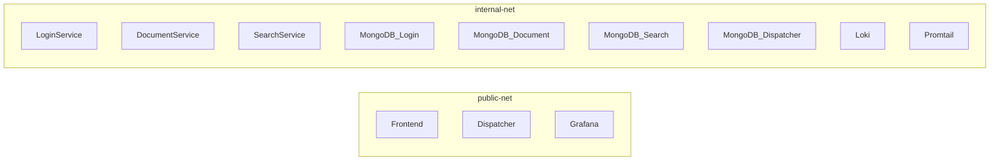

<h1 align="center">YAZ-LAB-II Kurum Arşivi</h1>
<p align="center">Dispatcher (API Gateway) tabanlı mikroservis mimarisi, JWT doğrulama, MongoDB veri izolasyonu, TDD, Grafana ve k6 yük testleri</p>

<p align="center">


  <br/>

  
  
  
  

  <br/>

  
  
  
  
  

  <br/>

  
  
  

</p>


## 1. Proje Bilgileri
* **Ders:** Yazılım Geliştirme Laboratuvarı-II / Proje-1
* **Proje Adı:** Kurum Arşivi
* **Teslim Tarihi:** 05.04.2026
* **Ekip Üyeleri:**
  * Şevval Ceren Yıldız
  * Sudenaz Güldal
---
## 2. Giriş

### Problemin Tanımı
Kurumsal ortamlarda belgelerin yönetimi, aranması ve güvenli erişimi büyük önem taşımaktadır. Geleneksel dosya sistemleri ve tek parçalı uygulamalar, ölçeklenebilirlik ve bakım açısından ciddi sorunlar yaratmaktadır.

### Amaç
Bu proje, kurumsal belgelerin dijital ortamda güvenli bir şekilde saklanmasını, yönetilmesini ve aranmasını sağlayan mikroservis tabanlı bir arşiv sistemi geliştirmeyi amaçlamaktadır.

### Kapsam
Sistem aşağıdaki bileşenlerden oluşmaktadır:
- **Dispatcher (API Gateway):** Tüm dış isteklerin tek giriş noktası
- **Login Service:** Kullanıcı kimlik doğrulama ve yetkilendirme
- **Document Service:** Belge ekleme, silme, listeleme işlemleri
- **Search Service:** Belge arama ve indeksleme
- **Frontend:** Kullanıcı arayüzü
---
## 3. Sistem Tasarımı

### Richardson Olgunluk Modeli (RMM)
Bu projede REST API tasarımında **Seviye 2** uygulanmıştır:

- **Seviye 0:** Tek endpoint, tek metot
- **Seviye 1:** Kaynaklar URI ile tanımlanır (`/api/documents`, `/api/auth`)
- **Seviye 2 (Uygulanan):** HTTP metodları doğru kullanılır:
  - `GET` → Listeleme/okuma
  - `POST` → Oluşturma
  - `PUT` → Güncelleme
  - `DELETE` → Silme
  - Uygun HTTP durum kodları: `200`, `201`, `204`, `401`, `403`, `404`, `409`
 
 #### Uygulanan REST örnekleri

- `POST /api/auth/login` → kullanıcı girişi
- `POST /api/auth/register` → yeni kullanıcı oluşturma
- `GET /api/auth/users` → kullanıcıları listeleme
- `DELETE /api/auth/users/{username}` → kullanıcı silme
- `PUT /api/auth/users/{username}/role` → kullanıcı rolü güncelleme
- `GET /api/documents` → belgeleri listeleme
- `GET /api/documents/{id}` → tek belge getirme
- `POST /api/documents` → belge oluşturma
- `PUT /api/documents/{id}` → belge güncelleme
- `DELETE /api/documents/{id}` → belge silme
- `GET /api/search?q=...` → belge arama
- `POST /api/search/index` → indeks oluşturma/güncelleme
- `DELETE /api/search/index/{documentId}` → arama indeksinden belge silme

Bu yapı sayesinde proje, `.../deleteUser?id=1` gibi RPC benzeri tasarım yerine kaynak odaklı REST yaklaşımını kullanmaktadır.


### Mikroservis Mimarisi


## 4. Mikroservislerin Sorumlulukları

| Bileşen | Temel Sorumluluk |
|---|---|
| Dispatcher.API | JWT doğrulama, yetki kontrolü, istek yönlendirme, hata kodu üretme, loglama |
| Login.Service | Kullanıcı kaydı, kullanıcı girişi, rol yönetimi, kullanıcı listeleme/silme |
| Document.Service | Belge CRUD işlemleri |
| Search.Service | Belge indeksleme ve anahtar kelime ile arama |
| Frontend | Kullanıcı ve admin arayüzü |
| Grafana/Loki/Promtail | Trafik ve log gözlemlenebilirliği |

### Sequence Diyagramı - Login




### Sequence Diyagramı - Belge Ekleme





## 5. Sınıf Yapısı ve OOP Yaklaşımı
Projede katmanlı ve arayüz temelli bir yapı tercih edilmiştir.

- **Controller katmanı** HTTP isteklerini karşılar.
- **Service katmanı** iş kurallarını içerir.
- **Repository katmanı** veri erişimini soyutlar.
- **DTO katmanı** servisler arası/veri taşıma amaçlı kullanılır.
- **Model katmanı** veri tabanı nesnelerini temsil eder.

Bu yapı ile:

- **Single Responsibility Principle:** Controller, Service ve Repository katmanları ayrıştırılmıştır.
- **Dependency Inversion Principle:** `IDocumentRepository`, `IDocumentService`, `IAuthService`, `ISearchService` gibi arayüzler kullanılmıştır.
- **Abstraction:** Veri erişimi doğrudan controller içinde yapılmamıştır.
- **Modülerlik:** Her mikroservis kendi iş sorumluluğu etrafında tasarlanmıştır.

###  Algoritmik Akış ve Karmaşıklık Notları

####  Dispatcher yönlendirme akışı
Dispatcher gelen isteğin path bilgisini inceleyerek hedef servisi belirler.

- `/api/auth` → Login.Service
- `/api/documents` → Document.Service
- `/api/search` → Search.Service

Bu karar süreci sabit sayıda koşul üzerinden ilerlediği için yaklaşık **O(1)** karmaşıklıktadır.

####    JWT doğrulama akışı
Dispatcher, `Authorization` header’ını kontrol eder, token biçimini doğrular ve JWT imzasını çözümler. İşlem token uzunluğuna bağlı olmakla birlikte uygulama ölçeğinde sabit maliyetli bir güvenlik adımı olarak değerlendirilebilir.

####  Arama işlemi
Search.Service, başlık ve içerik üzerinde regex tabanlı sorgu çalıştırmaktadır. Bu nedenle arama maliyeti indeks yapısına ve veri sayısına bağlıdır. Veri hacmi arttıkça sorgu maliyeti artabilir. Mevcut sürümde basit ama anlaşılır bir arama yaklaşımı tercih edilmiştir.

###   Literatür ve Kavramsal Arka Plan
Proje aşağıdaki yazılım mühendisliği kavramları temel alınarak geliştirilmiştir:

- Mikroservis mimarisi
- API Gateway / Dispatcher yaklaşımı
- Test Driven Development (TDD)
- RESTful servis tasarımı
- Richardson Maturity Model
- Docker ile orkestrasyon
- Merkezi loglama ve gözlemlenebilirlik


---
## 6. Proje Yapısı ve Modüller

### Klasör Yapısı



## 7. Kullanılan Teknolojiler

| Teknoloji | Kullanım Amacı |
|---|---|
| C# / ASP.NET Core 8 | Mikroservislerin geliştirilmesi |
| MongoDB | NoSQL veri saklama |
| Docker / Docker Compose | Servis orkestrasyonu |
| NUnit | Dispatcher testleri |
| JWT | Kimlik doğrulama |
| BCrypt | Parola hashleme |
| Serilog | Yapısal loglama |
| Grafana | Görselleştirme |
| Loki | Log depolama/sorgulama |
| Promtail | Container log toplama |
| HTML/CSS/JavaScript | Frontend |


## 8. Servis Portları ve Görevleri

| Servis | Container Port | Host Port | Görevi |
|---|---:|---:|---|
| Dispatcher.API | 8080 | 5000 | API Gateway olarak çalışır; JWT doğrulama, yetkilendirme kontrolü ve isteklerin ilgili mikroservise yönlendirilmesini sağlar. |
| Frontend | 80 | 3000 | Kullanıcının giriş yapabildiği, belge işlemlerini gerçekleştirebildiği ve arama yapabildiği kullanıcı arayüzünü sunar. |
| Grafana | 3000 | 3001 | Sistem loglarını ve trafik verilerini dashboard üzerinden görselleştirir. |
| Loki | 3100 | 3100 | Servislerden gelen logları toplar, saklar ve sorgulanabilir hale getirir. |
| Login.Service | 8080 | Dışarı açılmadı | Kullanıcı kayıt, giriş ve JWT token üretim işlemlerini yürütür. |
| Document.Service | 8080 | Dışarı açılmadı | Belge oluşturma, listeleme, silme ve diğer belge yönetim işlemlerini gerçekleştirir. |
| Search.Service | 8080 | Dışarı açılmadı | Belgelerin indekslenmesi ve arama işlemlerini yürütür. |
| MongoDB container’ları | 27017 | Dışarı açılmadı | Her servise ait bağımsız NoSQL veri tabanı altyapısını sağlar ve veri izolasyonunu destekler. |

###  Docker Ağ Yapısı

---


## 9. Network Isolation

Bu projede mikroservisler arası güvenlik ve erişim kontrolü için **network isolation** yaklaşımı uygulanmıştır. Amaç, sistemde dış dünyaya yalnızca **Dispatcher (API Gateway)** servisinin açık olması; Login, Document ve Search mikroservislerinin ise yalnızca Docker iç ağı üzerinden erişilebilir tutulmasıdır.

### Uygulanan yapı

- **Dispatcher**
  - Hem `public-net` hem `internal-net` ağına bağlıdır.
  - Host makineye `5000:8080` port eşlemesi ile açılmıştır.
  - Sistemin dış dünyaya açık olan ana backend giriş noktasıdır.

- **Login Service** & **Document Service** & **Search Service** 
  - Yalnızca `internal-net` ağına bağlıdır.
  - Host makineye publish edilmiş bir portu yoktur.

- **MongoDB servisleri**
  - Her servis için ayrı MongoDB container’ı kullanılmıştır.
  - Bu veritabanı servisleri de yalnızca `internal-net` ağı üzerinde çalışmaktadır.

Bu tasarım sayesinde dış istemciler mikroservislere doğrudan erişemez. Tüm dış istekler önce Dispatcher’a gelir, Dispatcher da uygun mikroservise yönlendirme yapar.

### Docker Compose düzeyinde izolasyon

Network isolation, Docker Compose yapılandırmasında aşağıdaki prensiplerle sağlanmıştır:

1. **Dispatcher hem public hem internal ağa bağlıdır.**
2. **Mikroservisler yalnızca internal ağda tanımlanmıştır.**
3. **Login, Document ve Search servisleri için host port publish edilmemiştir.**
4. **MongoDB servisleri de dış dünyaya açılmamıştır.**

Bu nedenle:
- dış istemci yalnızca Dispatcher’a erişebilir,
- mikroservisler yalnızca Docker iç ağı üzerinden haberleşir,
- veri tabanı katmanı dış erişime kapalı tutulur.

### Kanıtlayıcı ekran görüntüleri

#### 1. Servislerin port görünümü (`docker compose ps`)
Aşağıdaki çıktıda yalnızca Dispatcher servisinin host port eşlemesine sahip olduğu, diğer mikroservislerin ise yalnızca container iç portları ile çalıştığı görülmektedir.


**Şekil Açıklaması:**  
`docker compose ps` çıktısında Dispatcher için `5000->8080` port eşlemesi görünürken, `login-service`, `document-service` ve `search-service` için host port publish edilmediği görülmektedir. Bu durum mikroservislerin doğrudan dış erişime kapalı tutulduğunu göstermektedir.

---

#### 2. Dispatcher servis yapılandırması
Aşağıdaki yapılandırmada Dispatcher servisinin hem `public-net` hem `internal-net` üzerinde çalıştığı ve `5000:8080` port eşlemesi ile dış erişime açıldığı görülmektedir.


**Şekil Açıklaması:**  
Dispatcher servisi hem dış ağ hem iç ağ arasında köprü görevi görmekte ve sistemin tek backend giriş noktası olarak çalışmaktadır.

---

#### 3. Login Service yapılandırması
Aşağıdaki yapılandırmada Login Service’in yalnızca `internal-net` üzerinde tanımlandığı ve host’a publish edilmiş bir portunun bulunmadığı görülmektedir.


**Şekil Açıklaması:**  
Login Service yalnızca iç ağda çalışmakta, dış dünyaya doğrudan açılmamaktadır.

---

#### 4. Document Service yapılandırması
Aşağıdaki yapılandırmada Document Service’in yalnızca `internal-net` üzerinde çalıştığı görülmektedir.


**Şekil Açıklaması:**  
Document Service host makineye publish edilmemiştir; bu nedenle yalnızca Docker iç ağı üzerinden erişilebilir.

---

#### 5. Search Service yapılandırması
Aşağıdaki yapılandırmada Search Service’in yalnızca `internal-net` ağı üzerinde bulunduğu görülmektedir.


**Şekil Açıklaması:**  
Search Service dış istemcilere doğrudan açık değildir ve sadece iç ağ üzerinden erişilir.

### Sonuç

Bu projede network isolation, Docker Compose ağ yapısı ve port publish tercihleriyle sağlanmıştır. Dispatcher dış dünyaya açık tek backend bileşeni olarak konumlandırılmış; Login, Document ve Search servisleri ile bunlara ait MongoDB bileşenleri yalnızca iç ağ üzerinde tutulmuştur. Böylece mikroservis mimarisinde güvenlik, erişim kontrolü ve merkezi trafik yönetimi hedeflerine uygun bir yapı elde edilmiştir.

## 10. Uygulama Açıklamaları, Testler ve Sonuçlar

###  Uygulamanın Çalıştırılması

####   Gereksinimler

- Docker Desktop
- Docker Compose
- .NET 8 SDK (lokal geliştirme/test için)

####   Ortam değişkeni
Kök dizinde `.env` dosyası oluşturulup JWT anahtarı tanımlanmalıdır:

```env
JWT_SECRET=buraya-en-az-32-karakterlik-bir-gizli-anahtar-yazin
```

####   Sistemi ayağa kaldırma

```bash
docker compose up --build
```

####   Erişim adresleri

- Frontend: `http://localhost:3000`
- Dispatcher: `http://localhost:5000`
- Grafana: `http://localhost:3001`

###   Varsayılan Admin Kullanıcısı
Login.Service ilk açılışta varsayılan admin kullanıcısı üretmektedir.

- **Kullanıcı adı:** `admin`
- **Şifre:** `Admin123!`

> Güvenlik notu: Bu kullanıcı yalnızca geliştirme/demonstrasyon amacıyla düşünülmüştür. Üretim senaryosunda varsayılan parolanın değiştirilmesi gerekir.


###   Dispatcher TDD Testleri
Dispatcher bileşeni için NUnit ile testler yazılmıştır. Testler temel olarak aşağıdaki alanları kapsamaktadır:

#### AuthMiddleware testleri
- Token yoksa 401 dönmesi
- Authorization header `Bearer` formatında değilse 401 dönmesi
- Bearer token boşsa 401 dönmesi
- Geçersiz token varsa 401 dönmesi
- Geçerli token varsa pipeline’ın devam etmesi
- Login endpoint’inin token olmadan erişilebilir olması

#### RoutingMiddleware testleri
- `/api/documents` isteğinin Document.Service’e yönlenmesi
- `/api/search` isteğinin Search.Service’e yönlenmesi
- `/api/auth` isteğinin Login.Service’e yönlenmesi
- Bilinmeyen route için 404 dönmesi

#### RequestLoggingMiddleware testleri
- Başarılı isteğin loglanması
- 404 yanıtının loglanması
- Username bilgisinin loga yazılması
- Süre bilgisinin loga yazılması
- Hata durumunda error log üretilmesi

  

  
  


## 11. Performans ve Yük Testleri

Bu projede **Dispatcher** katmanının yoğun istek trafiği altındaki davranışını ölçmek için **k6** kullanılmıştır. k6 aracının profesyonel bir yük testi aracı olması ve sonuçların **ortalama yanıt süresi**, **P95 yanıt süresi** ve **hata oranı** gibi metriklerle sunulabilmesi, proje isterleriyle uyumludur. Ayrıca test sürecindeki trafik akışı **Grafana** üzerinden grafiksel olarak izlenmiş ve log tablosu ile desteklenmiştir.

---

### Test Senaryosu

Yük testleri, Docker ortamı ayağa kaldırıldıktan sonra **Dispatcher** üzerinden gerçekleştirilmiştir. Test senaryosunda önce `/api/auth/login` endpoint’i ile giriş yapılarak **JWT** alınmış, ardından yetkili istekler Dispatcher üzerinden aşağıdaki endpoint’lere gönderilmiştir:

- `GET /api/auth/users`
- `GET /api/documents`

Bu senaryo ile aynı anda hem **kimlik doğrulama**, hem **yönlendirme**, hem de **mikroservislere trafik aktarımı** gözlemlenmiştir.

---

### Kullanılan k6 Yaklaşımı

Her sanal kullanıcı (VU), test boyunca aşağıdaki akışı izlemiştir:

1. `POST /api/auth/login` ile giriş yapma  
2. JWT token alma  
3. Yetkili olarak sırasıyla:
   - `GET /api/auth/users`
   - `GET /api/documents`
4. Yanıt sürelerini ve hata oranlarını ölçme  

---

### Test Seviyeleri

Projede aşağıdaki yük seviyeleri uygulanmıştır:

- **50 VU – 2 dakika**
- **100 VU – 2 dakika**
- **200 VU – 2 dakika**
- **500 VU – 2 dakika**

Bu test seviyeleri, proje yönergesinde örneklenen eşzamanlı istek senaryolarını karşılamaktadır.

---

### Test Sonuçları

| Yük Seviyesi | Süre | Toplam HTTP İsteği | Ortalama Yanıt Süresi | P95 Yanıt Süresi | Hata Oranı | Sonuç |
|---|---:|---:|---:|---:|---:|---|
| 50 VU | 2 dk | 5905 | 18.66 ms | 55.61 ms | 0.00% | Başarılı |
| 100 VU | 2 dk | 11803 | 20.78 ms | 64.21 ms | 0.00% | Başarılı |
| 200 VU | 2 dk | 23460 | 23.43 ms | 78.64 ms | 0.00% | Başarılı |
| 500 VU | 2 dk | 56986 | 54.83 ms | 243.22 ms | 0.00% | Başarılı |

Bu tabloda kullanılan metrikler **k6 test özetlerinden** alınmıştır.  
50 VU testinde **P95 = 55.61 ms** ve hata oranı **%0**,  
100 VU testinde **P95 = 64.21 ms** ve hata oranı **%0**,  
200 VU testinde **P95 = 78.64 ms** ve hata oranı **%0**,  
500 VU testinde ise **P95 = 243.22 ms** ve hata oranı yine **%0** olarak ölçülmüştür.

---

### Sonuçların Yorumu

Test sonuçları incelendiğinde sistemin yük arttıkça beklenen şekilde daha fazla trafik ürettiği, ancak buna rağmen hata üretmeden çalışmaya devam ettiği görülmüştür. **500 eşzamanlı kullanıcı** seviyesinde bile hata oranının **%0** kalması, Dispatcher katmanının **yönlendirme** ve **yetkilendirme** işlemlerini kararlı biçimde sürdürdüğünü göstermektedir.

Ortalama yanıt süresi ve **P95** değeri yük arttıkça yükselmiş olsa da tüm testlerde kabul edilebilir sınırlar içinde kalmıştır. Özellikle **500 VU** testinde **P95 = 243.22 ms** değeri elde edilmesi, sistemin yoğun yük altında dahi cevap verebildiğini göstermektedir.

---

### k6 Çıktıları

Aşağıda her yük seviyesi için alınan **k6 özet ekran görüntüleri** verilmiştir:


#### 50 VU – k6 Özet


#### 100 VU – k6 Özet


#### 200 VU – k6 Özet


#### 500 VU – k6 Özet


### Grafana ile Trafik İzleme ve Görselleştirme

Projede yalnızca yük testi sonuçları sayısal olarak değerlendirilmemiş, aynı zamanda sistem üzerinden geçen trafik **Grafana** ile görselleştirilmiştir. Bu sayede Dispatcher katmanına gelen istek yoğunluğu, zaman içindeki değişimiyle birlikte grafiksel olarak izlenebilmiştir.

Grafana paneli üzerinden özellikle aşağıdaki noktalar gözlemlenmiştir:

- Dispatcher üzerinden geçen istek sayısının yük arttıkça yükselmesi
- Trafik yoğunluğunun zamana bağlı değişiminin grafiksel olarak izlenebilmesi
- Sistem davranışının log kayıtları ile birlikte doğrulanabilmesi

Bu görselleştirme, proje isterlerinde belirtilen **“trafik akışının grafiksel arayüz ile sunulması”** beklentisini karşılamaktadır. Ayrıca Grafana ekranı ile birlikte kullanılan log tablosu, aynı trafik hareketlerinin ayrıntılı kayıtlarını da göstermektedir.

#### Dispatcher İstek Trafiği – Grafana

Aşağıda yük testleri sırasında Dispatcher üzerinden geçen istek trafiğinin Grafana paneli üzerindeki görünümü yer almaktadır:


Grafik incelendiğinde, yük seviyesi arttıkça sistemin daha yoğun istek aldığı açık biçimde görülmektedir. Buna rağmen sistemin istekleri işlemeye devam etmesi ve hata üretmemesi, mimarinin yoğun trafik altında da kararlı çalıştığını desteklemektedir.

#### Log Tablosu Görünümü

Grafana ile birlikte log kayıtları da takip edilmiştir. Böylece yalnızca grafiksel trafik yoğunluğu değil, aynı zamanda hangi isteklerin hangi zaman aralığında işlendiği de gözlemlenebilmiştir.


Bu yapı sayesinde sistemin hem **anlık izlenebilirliği** sağlanmış hem de yük testleri sırasında oluşan istek hareketleri ayrıntılı biçimde doğrulanmıştır.

## 12. Sonuç ve Tartışma

###   Elde Edilen Başarılar
Bu projede:

- En az 4 bağımsız bileşenden oluşan mikroservis mimarisi kurulmuştur.
- Dispatcher sistemin tek giriş noktası olacak şekilde konumlandırılmıştır.
- JWT tabanlı kimlik doğrulama uygulanmıştır.
- Yetki kontrolü Dispatcher katmanında merkezi hale getirilmiştir.
- Login, Document ve Search servisleri ayrıştırılmıştır.
- Her servis için bağımsız MongoDB kullanılmıştır.
- Belge oluşturma/güncelleme/silme ile arama indeksinin senkron ilerlemesi sağlanmıştır.
- Docker Compose ile tüm yapı tek komutla ayağa kaldırılabilir hale getirilmiştir.
- Logların Grafana-Loki-Promtail ile gözlemlenmesi sağlanmıştır.

###   Sınırlılıklar
Bu sürümde aşağıdaki sınırlılıklar bulunmaktadır:

- Search işlemi regex tabanlı basit arama yaklaşımı kullanmaktadır; büyük veri kümelerinde daha gelişmiş indeksleme mekanizmaları gerekebilir.
- Frontend temel seviyede tutulmuştur; kullanıcı deneyimi geliştirilebilir.
- Yük testi sonuçları ayrıca üretilip rapora eklenmelidir.
- Dispatcher için ayrı MongoDB container mimaride tanımlı olsa da mevcut sürümde Dispatcher tarafındaki kalıcı veri kullanımı sınırlıdır; bu bölüm teslim öncesi isterlerle tekrar karşılaştırılmalıdır.

###   Olası Geliştirmeler
İleride aşağıdaki geliştirmeler yapılabilir:

- Search.Service için daha gelişmiş full-text search altyapısı eklenmesi
- Rol bazlı daha ayrıntılı yetkilendirme politikaları
- Rate limiting ve circuit breaker mekanizmaları
- Refresh token yapısı
- Merkezi configuration yönetimi
- Sağlık kontrolleri (health checks)
- Otomatik test kapsamının Login, Document ve Search servislerine genişletilmesi
- CI/CD hattı kurulması

###  Genel Değerlendirme
Kurum Arşivi projesi, mikroservis mimarisi, Docker orkestrasyonu, Dispatcher tabanlı trafik yönetimi, JWT doğrulama, TDD yaklaşımı ve temel gözlemlenebilirlik kavramlarını bir araya getiren bütüncül bir uygulama olmuştur. Proje, ders isterlerinde beklenen mimari düşünme, modüler geliştirme ve servis ayrıştırma hedeflerini büyük ölçüde karşılamaktadır.

---

## 12. Projenin İsterlerle Eşleştirilmesi

| İster | Projedeki Karşılığı |
|---|---|
| En az 4 bağımsız ünite | Dispatcher + Login + Document + Search + Frontend + izleme bileşenleri |
| Dispatcher tek giriş noktası | Tüm dış backend erişimi `localhost:5000` üzerinden |
| TDD | Dispatcher middleware testleri NUnit ile yazılmıştır |
| RMM Seviye 2 | URI + uygun HTTP method + durum kodları kullanılmıştır |
| Her servise ayrı NoSQL yapı | Login, Document, Search ve Dispatcher için ayrı MongoDB container tanımlanmıştır |
| Network Isolation | Mikroservisler host portu olmadan internal ağda çalışmaktadır |
| JSON veri aktarımı | Servisler arası veri aktarımı JSON formatındadır |
| Grafiksel izleme ve log tablosu | Grafana + Loki + Promtail ile sağlanmıştır |
| Dockerize mimari | `docker compose up --build` ile ayağa kalkmaktadır |
| README raporu | Markdown + Mermaid ile hazırlanmıştır |

---

## 13. Kaynakça

- Markdown Guide
- Mermaid Documentation
- Microservices.io
- RESTful API ve Richardson Maturity Model kaynakları
- Docker Compose resmi dokümantasyonu
- TDD ve yazılım mühendisliği literatürü

